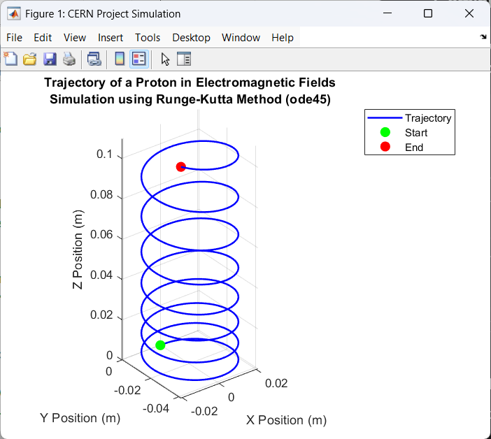

# Simulation of Charged Particle Motion in Electromagnetic Fields


## 📌 Project Overview
This project simulates the 3D trajectory of a charged particle (proton) moving under the influence of **Lorentz Force** in combined magnetic and electric fields. The simulation serves as a computational model to demonstrate beam dynamics concepts used in high-energy physics (e.g., CERN's LHC).


*(Figure 1: Visualized trajectory showing the helical path of a proton.)*

---

## 🚀 Quick Start (How to Run)
1.  Clone this repository:
    ```bash
    git clone https://github.com/ahsenzeynepaslan/Lorentz_Force_Particle_Simulation.git
    (https://github.com/ahsenzeynepaslan/Lorentz_Force_Particle_Simulation.git)
    ```
2.  Open **MATLAB**.
3.  Run the script `Lorentz_Simulation.m`.
4.  Interact with the 3D plot using the rotate tool.

---

## 📑 Scientific Report: Computational Analysis

### 1. Introduction
In experimental high-energy physics, controlling the path of charged particles is paramount. Particle accelerators rely on strong magnetic fields to steer particles and electric fields to accelerate them. This project validates the theoretical prediction of helical trajectories through numerical analysis using MATLAB.

### 2. Mathematical Formulation
The dynamics of a particle with charge $q$ and mass $m$ are governed by the **Lorentz Force Law**:

$$\vec{F} = q(\vec{E} + \vec{v} \times \vec{B})$$

Using Newton's Second Law, the system is described by the differential equation:

$$\frac{d\vec{v}}{dt} = \frac{q}{m} (\vec{E} + \vec{v} \times \vec{B})$$

* **$B$ (Magnetic Field):** Causes centripetal force (Cyclotron motion).
* **$E$ (Electric Field):** Causes axial acceleration.

### 3. Methodology & Algorithm
The differential equations are non-linear and coupled. To solve this system with high accuracy, the **Runge-Kutta (RK45)** numerical method was employed via MATLAB's `ode45` solver.
* **Why RK45?** It provides superior stability and precision for oscillatory systems compared to standard Euler methods.
* **Error Tolerance:** Set to $10^{-6}$ for high-precision particle tracking.

### 4. Results
The simulation successfully models the **helical trajectory**, confirming two simultaneous physical phenomena:
* **Cyclotron Rotation:** Driven by the magnetic field ($B_z$).
* **Linear Acceleration:** Driven by the electric field ($E_z$).

---

## 👨‍💻 Author
**Ahsen Aslan**
* *Mathematics & Computer Science Student*
* *Aspiring CERN Summer Student*
